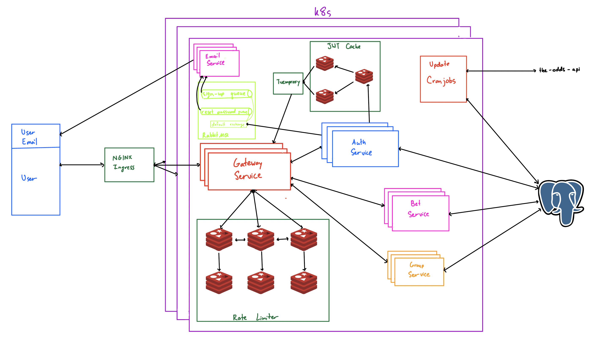
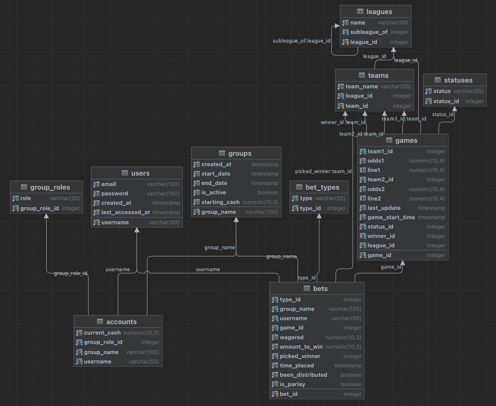

# Better2

Backend of a group-based, simulated sports betting app. Written in Java, utilizing PostgreSQL, Redis, Twemproxy, NGINX, RabbitMQ, Maven, Docker, and Kubernetes. Frontend can be found at https://github.com/sebaraj/BetterSquared-Frontend. 

[//]: # (add link to api here too)

[//]: # (languages: Java)

[//]: # (DB/Cache: postgres@16, redis)

[//]: # (tech/protocols: nginx, rabbitmq, HTTPS, AMQP, SMTP, JWTs)

[//]: # (build/deployment tools: Maven managing build process/dependencies, Docker containerization, k8s orchestration, minikube, k9s)

## Components:

[//]: # (insert picture here showing overall structure)

### Ingress
- NGINX ingress functioning as a reverse proxy, load balancer across k8s nodes, and SSL/TLS terminator, forwarding HTTP traffic towards gateway service. 

### Gateway Service
- HTTP server which directs incoming requests and outgoing responses to and from their appropriate services.
- Interfaces with JWT cache (and authentication service on cache miss) and rate limiter to maximize performance while minimizing unauthorized access.

### Rate Limiter
- Sliding-log rate limiter based on host IP via a sharded, replicated Redis cluster. 

### Authentication Service
- Handles signup, login, reset password, and populates JWT cache during validation requests
- Asynchronously sends messages (via AMQP) to the email notification service for user signup and password reset via message queues (RabbitMQ, default exchange).

### JWT Cache
- Read-through, LRU, JWT-key, username-value cache with TTL set at JWT expiration time.
- Distributes reads across all slave instances via twemproxy (nutcracker).

### Email Notification Service
- Asynchronously delivers messages to client email (via SMTP w/ TLS) from messages in queues (RabbitMQ).

### Group Service
- Provides client endpoints for all group-related CRUD operations 

### Bet Service
- Provides client endpoints for all bet-related CRUD operations

### Update Cronjobs
- Performs the following non-client-facing jobs:

  - Adds new games on information from api call (runs as a scheduled cronjob on non-persistent containers)
  - Updates game status from "upcoming" to "playing" when game starts via Quartz scheduler and appropriate triggers (runs on a persistent container)
  - Updates game status from "playing" to "settled" based on information from api call and distributes winnings to users on respective bets (runs as a scheduled cronjob on non-persistent containers)
  - Updates group status after the last active day (runs as a scheduled cronjob on non-persistent containers)
- Completed jobs/pods are manually garbage collected every 6 hours (see ./cleanpods/manifests)

### RabbitMQ
- Message queue with 1 GiB PVC and durable messages. Utilizes direct exchange into two queues.

### PostgreSQL DB 
- Persistent data store for backend, running outside k8s cluster.

## Deploying:

Note: I have intentionally left all env variables (in configmaps/secrets) visible and the files unencrypted for straight-forward deployment. This is NOT a suitable solution for deployment. If you would like to customize/change them, please see the respective yaml files.

### PostgreSQL
- Install PostgreSQL
    - `brew install postgresql@16`
    - `initdb /usr/local/var/postgres/`
- Start PostgreSQL
    - `brew services start postgresql` (for postgres to run as background service)
    - `pg_ctl -D /usr/local/var/postgres/ start` (for postgres to run in the foreground)
- Initialize DB Tables, Triggers, and Indeces
    - `psql` 
    - `CREATE USER authdbuser WITH PASSWORD 'testauth' CREATEDB;`
    - `CREATE DATABASE authdb with OWNER = authdbuser;`
    - `\q`
    - Insert your host, port, database, user at the top of create_psql_tables.sh (in project root directory). 
    - `./create_psql_tables.sh`
- Drop Tables (and triggers/indeces) in DB
    - Insert your host, port, database, user at the top of drop_psql_tables.sh (in project root directory).
    - `./drop_psql_tables.sh`  

### Docker
- Install Docker:
  - `brew install --cask docker` 
  - Grant docker privileged access (message should appear when you launch docker).
  
### Kubernetes
- Install Kubernetes:
  - `brew install kubectl`

### Minikube
- Install Minikube:
  - `brew install minikube`
  - `minikube config set cpu 4`
  - `minikube config set memory 8192`

### Self-signed certificate
- Generate your own self-signed certificate for TLS:
  - In the root of this project directory, run: 
  - `openssl req -x509 -nodes -days 365 -newkey rsa:2048 -keyout tls.key -out tls.crt -config openssl.cnf`
  - `sudo security add-trusted-cert -d -r trustRoot -k /Library/Keychains/System.keychain tls.crt`
- Install the Certificate in Your Browser:
  - Go to chrome://settings/security
  - Under "Manage certificates", import tls.crt and trust it.

### /etc/hosts
- Add `127.0.0.1 better2.com`, `127.0.0.1 kubernetes.docker.internal`, and `{minikube_ip} host.minikube.internal` to /etc/hosts (need sudo permissions).

### Starting Backend
- `./start-backend.sh` in this project root directory, with sudo permissions, to deploy on local computer via minikube.

## Client-Accessible Endpoints
- See `better2_endpoints.yaml`

## Monitoring Backend
### RabbitMQ
- http://rabbitmq-manager.com, add `127.0.0.1 rabbitmq-manager.com` in /etc/hosts with sudo permissions.
- Default login: username "guest" and password "guest".

### Kubernetes
- For monitoring k8s clusters on minikube, `k9s` provides a straight-forward, yet effective approach to monitor/manage all cluster resources.
- Install with `brew install derailed/k9s/k9s`.
- Run with `k9s`.

### PostgreSQL
- For monitoring Postgres, `pgAdmin` provides essential tools.
- Install at https://www.pgadmin.org.
- Run the following:
  - `psql` 
  - `CREATE EXTENSION IF NOT EXISTS pg_stat_statements;`
  - `SELECT * FROM pg_extension WHERE extname = 'pg_stat_statements';`

## To-Do
- Infrastructure:
  - Add rigorous testing suite: unit tests, docker build time tests, end-to-end tests, and performance tests
  - Configure all Postgres connections to use TLS and implement asynchronous, streaming replication for Postgres
  - Switch internal HTTP w/ JSON (not AMQP) service-to-service messages to gRPC
  - Implement logging framework (log4j)
  - Re-draw backend architecture using proper tooling
- Features:
  - Add more leagues/bet types
  - Implement parlay bets
  - Implement ability to restrict groups to a subset of leagues